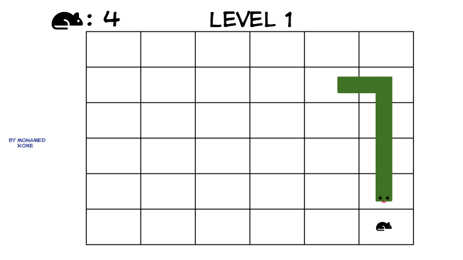
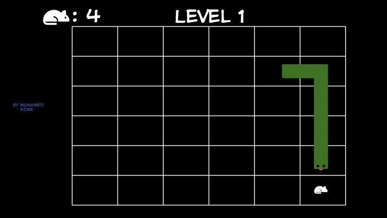

# Snake Escape

## Date: 11/18/2021

### By: Mohamed Kone

#### [GitHub](https://github.com/Mohamedkone) | [LinkedIn](https://www.linkedin.com/in/mohamed-kone-45362480/)

---

### **_Description_**

#### You remember the old Snake game? This is not that. This is a re-imaginated version in javascript

---

### **_Technology Used_**

- HTML
  - Canvas
- CSS
- Javascript
- Chrome
  - Chrome Console
- Git
  - GitHub
- VsCode
- Adobe illustrator

### **_Getting Started_**

##### Navigate the grid by using the arrow or WASD keys.

##### Collect rats to get bigger

##### After collecting 10\*n rats the player acces the next level

##### A Trello board was used to keep track of development progress and can be viewed [here](https://trello.com/b/yrrXbFhr/gameproject).

##### The project itself ill be deployed and available [Will be updated later].

---

### **_Screenshots_**

#### Wireframe

#### Wireframe Dark Mode

### **_Future updates_**

- [ ] Not Planned yet

### **_Credits_**
